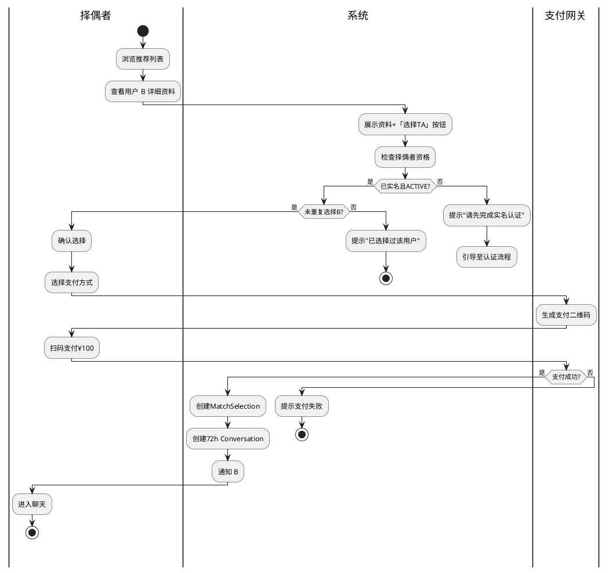

# OO 能力胶囊 C08：Activity Diagram 生成器

将复杂流程可视化为 UML 活动图（泳道图）。

## 触发条件

活动图、Activity Diagram、泳道、swimlane、业务流程、工作流、flowchart、BPMN

## 输入

- Use Case 规约（C03）
- 或 Sequence Diagram（C06）
- 或业务规则描述

## 输出规范



### 泳道（Partition）定义

```
| 泳道 | 职责 | 对应 OO 类 |
|------|------|-----------|
| 择偶者 | 触发动作、输入信息 | Actor |
| 系统 | 业务规则判断、数据持久化 | MatchService |
| 支付网关 | 支付处理 | IPaymentGateway |
| AI引擎 | 计算匹配 | IAIMatcher |
```

### 节点类型速查

```
(action)     → 原子活动
if/else      → 条件分支
fork/join    → 并行分叉
(*) → start  → 开始
(*) → stop   → 终止
detach       → 异常退出
```

## OO 检查

- [ ] 每个泳道对应明确的 OO 组件？
- [ ] 条件分支是否有互斥完备的守卫？
- [ ] fork 节点是否有对应的 join？
- [ ] 是否有死路径（不可达的 stop）？
