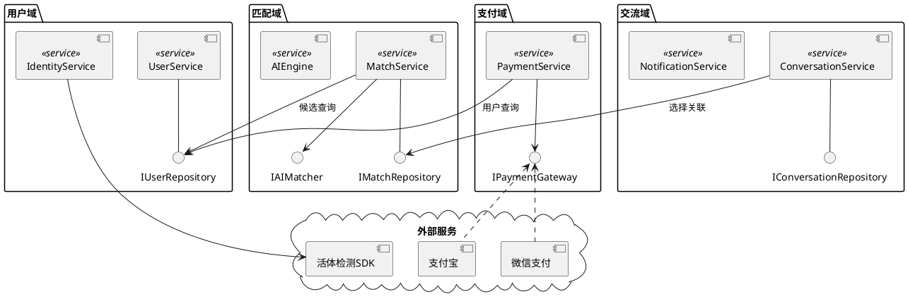

# OO 能力胶囊 C09：Component Diagram 生成器

从类图推导系统组件划分与接口。

## 触发条件

组件图、Component Diagram、模块设计、架构图、系统拆分、微服务、包图

## 输出规范



### 组件拆分原则

```
| 原则 | 说明 |
|------|------|
| 高内聚 | 同一聚合的类放同一组件 |
| 低耦合 | 组件间仅通过接口通信 |
| 接口隔离 | 每个组件暴露最小接口 |
| 单向依赖 | 避免循环依赖 |
```

### 组件描述表

```
| 组件 | 类型 | 提供接口 | 需求接口 | 技术栈建议 |
|------|------|---------|---------|-----------|
| UserService | Service | UserAPI | IUserRepository | Spring Boot |
| MatchService | Service | MatchAPI | IAIMatcher, IUserRepository | Python/FastAPI |
| PaymentService | Service | PaymentAPI | IPaymentGateway | Go/Gin |
```
