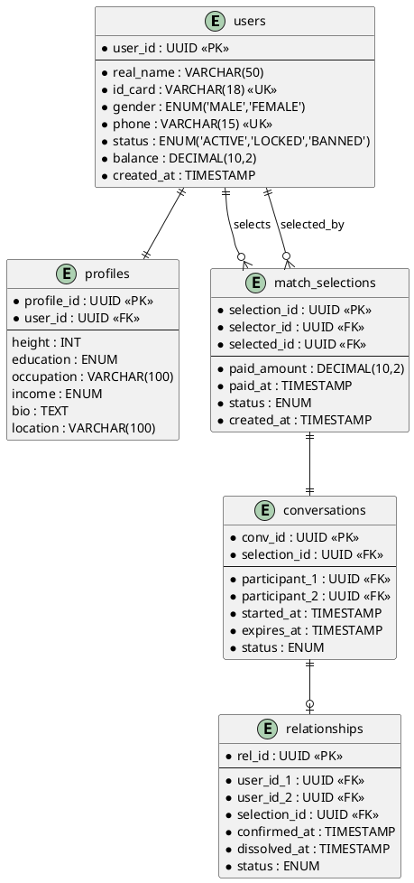

# OO 能力胶囊 C12：DB Schema 生成器

从领域模型映射到关系数据库 Schema。

## 触发条件

数据库设计、DB Schema、DDL、ER图、建表、数据模型、MySQL、PostgreSQL、MongoDB

## 输入

- Domain Model（C04）
- Class Diagram（C05）

## 输出规范

### 1. ER 图（PlantUML IE记法）



### 2. DDL（PostgreSQL）

```sql
CREATE TYPE user_status AS ENUM ('ACTIVE', 'LOCKED', 'BANNED');

CREATE TABLE users (
    user_id UUID PRIMARY KEY DEFAULT gen_random_uuid(),
    real_name VARCHAR(50) NOT NULL,
    id_card VARCHAR(18) NOT NULL UNIQUE,
    gender gender_type NOT NULL,
    phone VARCHAR(15) NOT NULL UNIQUE,
    status user_status NOT NULL DEFAULT 'ACTIVE',
    balance DECIMAL(10,2) NOT NULL DEFAULT 0,
    created_at TIMESTAMP NOT NULL DEFAULT NOW()
);

CREATE TABLE match_selections (
    selection_id UUID PRIMARY KEY DEFAULT gen_random_uuid(),
    selector_id UUID NOT NULL REFERENCES users(user_id),
    selected_id UUID NOT NULL REFERENCES users(user_id),
    paid_amount DECIMAL(10,2) NOT NULL,
    paid_at TIMESTAMP NOT NULL,
    status selection_status NOT NULL DEFAULT 'PENDING',
    created_at TIMESTAMP NOT NULL DEFAULT NOW(),
    CONSTRAINT chk_no_self_select CHECK (selector_id <> selected_id)
);

-- 防止重复选择（同一对，未过期）
CREATE UNIQUE INDEX idx_active_selection 
  ON match_selections(selector_id, selected_id) 
  WHERE status = 'PENDING';
```

### 3. 索引策略

```
| 表 | 索引 | 类型 | 原因 |
|----|------|------|------|
| users | status | B-tree | 按状态筛选候选池 |
| match_selections | selector_id+status | composite | 检查重复选择 |
| conversations | expires_at | B-tree | 定时清理过期会话 |
| relationships | user_id_1, user_id_2 | composite UNIQUE | 防止重复关系 |
```

### 4. OO→DB 映射规则

```
| OO 概念 | DB 映射 |
|----------|--------|
| Entity | Table（每实体一表） |
| Value Object | 嵌入父表字段 或 JSONB |
| 1:1 composition | 外键 + ON DELETE CASCADE |
| 1:N association | 外键在多方 |
| M:N association | 中间表 |
| Enum | ENUM 类型 或 VARCHAR + CHECK |
| Aggregate Root | 表 + 级联规则 |
```
