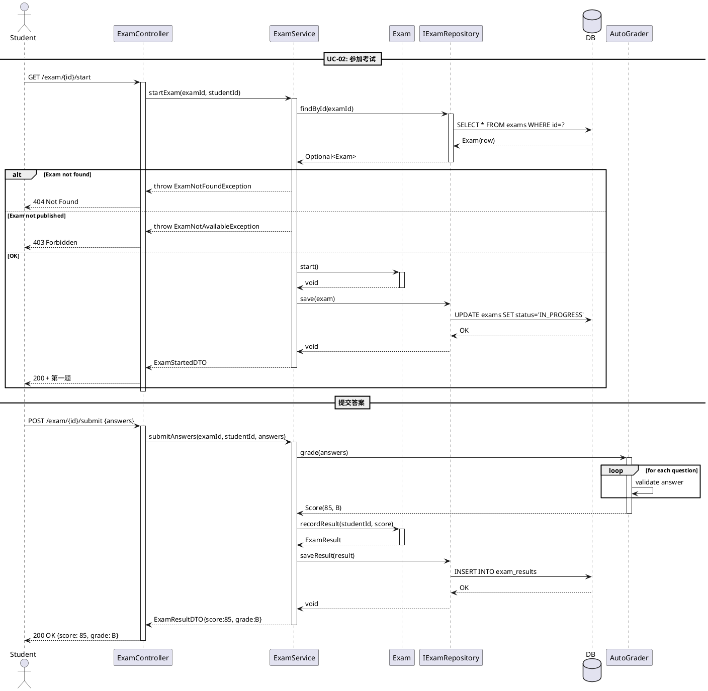

# OO 能力胶囊 C06：Sequence Diagram 生成器

将 Use Case 的主成功场景转化为对象协作时序图。

## 触发条件

用户提到：时序图、Sequence Diagram、消息序列、交互流程、调用链、生命线、UML 时序

## 输入格式

- Use Case 规约（来自 C03）
- 或 Class Diagram（来自 C05）
- 或一段业务流程描述

## 输出规范

### 1. PlantUML 时序图



### 2. 参与者映射

```
| 图中名称 | 类型 | 对应类 | 职责 |
|----------|------|--------|------|
| Student | Actor | - | 触发用例 |
| ExamController | Boundary | ExamController | HTTP 请求处理 |
| ExamService | Control | ExamService | 业务逻辑编排 |
| Exam | Entity | Exam | 考试领域对象 |
| IExamRepository | Interface | IExamRepository | 数据访问抽象 |
| DB | External | - | 持久化存储 |
| AutoGrader | Service | AutoGrader | 自动评分 |
```

### 3. 消息契约

```
| 消息 | 方向 | 参数 | 返回 | 异常 |
|------|------|------|------|------|
| startExam | → | examId, studentId | ExamStartedDTO | ExamNotFound, ExamNotAvailable |
| findById | → | examId | Optional<Exam> | - |
| start() | → | - | void | IllegalStateException |
| submitAnswers | → | examId, studentId, answers | ExamResultDTO | ValidationException |
| grade() | → | answers | Score | - |
```

### 4. 组合片段说明

```
| 片段 | 用途 | 示例 |
|------|------|------|
| alt | 条件分支 | 正常/异常路径 |
| loop | 循环 | 遍历题目列表 |
| opt | 可选 | 仅当条件满足时执行 |
| par | 并行 | 同时发多个请求 |
| ref | 引用 | 引用另一个时序图 |
```

## OO 设计要点

- **Boundary**: 处理外部请求，不包含业务逻辑
- **Control**: 编排业务流程，协调多个 Entity/Service
- **Entity**: 领域对象，封装自身状态和行为
- **自调用** (`A -> A`): 表示对象内部方法调用，体现封装
- **返回消息** (`-->`): 虚线箭头，表示返回值

## 自查清单

- [ ] 每个 Use Case 主成功场景是否完整覆盖？
- [ ] Border/Control/Entity 是否职责分明？
- [ ] 是否有超长生命线（>10 条消息）→ 考虑拆分
- [ ] 异常路径是否通过 alt/opt 片段覆盖？
- [ ] 数据库/外部系统是否正确标识？
