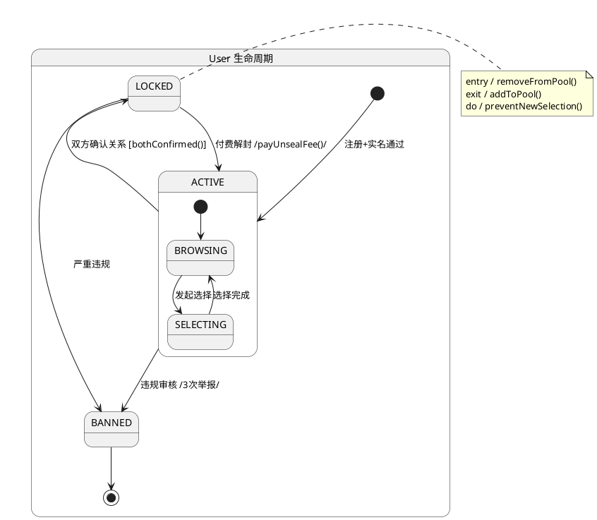

# OO 能力胶囊 C07：State Diagram 生成器

从 Class Diagram 提取有状态对象，生成 UML 状态图。

## 触发条件

状态图、State Diagram、状态机、state machine、生命周期、状态转移、guard condition

## 输入

- Class Diagram（C05 产出）
- 或指定需要状态建模的类名

## 输出规范

### 对每个有状态实体，生成：



### 状态规格表

```
| 状态 | entry动作 | exit动作 | do动作 | 合法转移至 |
|------|----------|---------|--------|-----------|
| ACTIVE | - | - | 接收推荐 | LOCKED, BANNED |
| LOCKED | removeFromPool | addToPool | 阻断选择 | ACTIVE, BANNED |
| BANNED | disableAccount | - | - | - |
```

### 守卫条件标注

每个转移上标注 `[guard]`：
- `[bothConfirmed()]` → 仅双方确认时触发
- `[paymentSuccess()]` → 支付成功
- `[reportCount >= 3]` → 举报达阈值

## OO 检查

- [ ] 是否识别了所有有状态的核心类？
- [ ] 每个状态是否有明确的 entry/exit 动作？
- [ ] 是否有不可达状态（orphan state）？
- [ ] 转移条件是否互斥且完备？
