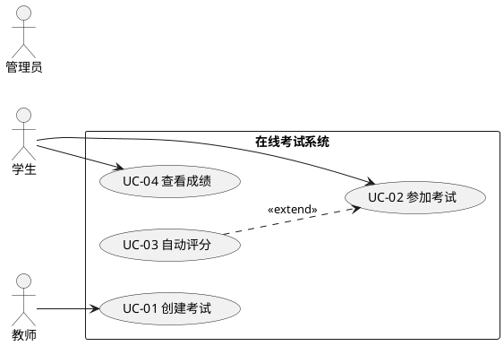

# OO 能力胶囊 C03：Use Case 建模器

从 User Story 生成 UML Use Case 模型。

## 触发条件

用户提到：用例、Use Case、用例图、用例建模、Actor、主成功场景、扩展场景、前置条件

## 输入格式

- User Story 列表（来自 C02）
- 或功能需求列表
- 需包含 Actor 角色信息

## 输出规范

### 1. Actor 目录

```
| Actor | 类型 | 描述 | 涉及用例 |
|-------|------|------|---------|
| 学生 | Primary | ... | UC-01,UC-02,UC-03 |
| 管理员 | Primary | ... | UC-04,UC-05 |
| 支付网关 | Secondary | ... | UC-06 |
| 时钟 | Secondary | 定时触发 | UC-07 |
```

### 2. Use Case 图（PlantUML）



### 3. 每个用例的完整规约

```
用例编号: UC-01
用例名称: 创建考试
范围: 在线考试系统
级别: 用户目标
主要 Actor: 教师
前置条件: 教师已登录，课程已创建
后置条件(成功): 考试已创建并保存，学生可查看
后置条件(失败): 错误信息提示，表单保留用户输入

主成功场景:
  1. 教师点击「创建考试」
  2. 系统展示考试表单（名称、时间、题目组）
  3. 教师填写考试信息并提交
  4. 系统验证数据完整性
  5. 系统保存考试并返回确认

扩展场景:
  2a. 教师无课程 → 提示先创建课程
  4a. 必填字段为空 → 标红提示，返回步骤3
  4b. 考试时间冲突 → 警告但允许继续
```

### 4. 用例关系矩阵

```
        UC-01  UC-02  UC-03  UC-04
UC-01     -      -      -      -
UC-02  include   -      -      -
UC-03  extend    -      -      -
UC-04     -    extend   -      -
```
(include=必须, extend=可选)

## OO 衔接

- Use Case 的 Actor → 系统边界类
- Use Case 名称 → Controller 类的方法名
- 主成功场景步骤 → Sequence Diagram (C06) 的消息序列
- 扩展场景 → 异常处理设计

## Self-Check

- [ ] 每个 Actor 至少参与一个 Use Case？
- [ ] 每个 Use Case 都有明确的前置/后置条件？
- [ ] <<include>> 和 <<extend>> 使用正确？
- [ ] 主成功场景不包含 UI 细节（只说"系统展示"，不说"点击按钮"）？
