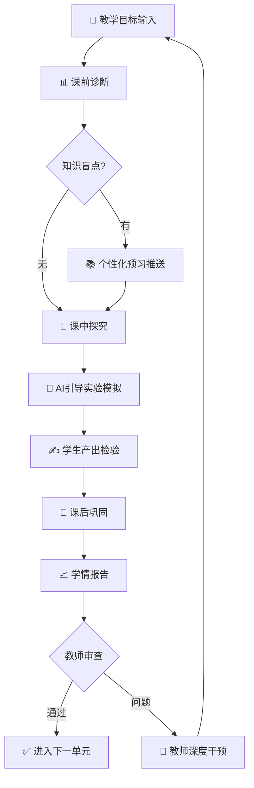

# T01：TAIS 教学工作流编排器

Teacher-AI-Student 模式的核心编排引擎。教师输入目标，输出完整教学工作流。

## 触发条件

TAIS、教学工作流、教学设计、课程编排、PBL、探究式学习、HITL教学

## 输入

教师自然语言描述教学目标：
> "为高中物理'牛顿第二定律'设计探究式学习工作流，含课前诊断、课中引导、课后巩固"

## 输出规范

### 1. 工作流有向图



### 2. 节点定义

每个节点包含：角色、智能体、输入、输出、HITL触发条件

```yaml
nodes:
  - id: diagnosis
    name: 课前诊断
    agent: tais-learning-analyst
    input: 学生前置知识数据
    output: 知识盲点热力图
    hitl_trigger: 诊断置信度 < 70%
    
  - id: inquiry
    name: 课中引导
    agent: tais-socratic-tutor
    input: 学生回答记录
    output: 追问序列
    hitl_trigger: 连续3次追问无进展
    
  - id: practice
    name: 课后巩固
    agent: tais-skill-coach
    input: 学生作业提交
    output: 实时反馈+错题分析
    hitl_trigger: 共性错误率 > 40%
```

### 3. HITL 介入点设计

| 节点 | 触发条件 | 介入方式 | 教师操作 |
|------|---------|---------|---------|
| 诊断 | 置信度<70% | 升级任务 | 人工判读+标注 |
| 引导 | 3次追问无进展 | 暂停+通知 | 深度讲解+示范 |
| 巩固 | 共性错误>40% | 批量标记 | 调整教学策略 |
| 审查 | 单元结束 | 生成报告 | 审核+调整方向 |

## 能力胶囊联动

TAIS工作流可调用OO能力胶囊生成教学内容：
- `oo-prd-generator` → 生成课程设计文档
- `oo-use-case` → 建模学习场景
- `oo-activity-diagram` → 可视化学习流程
